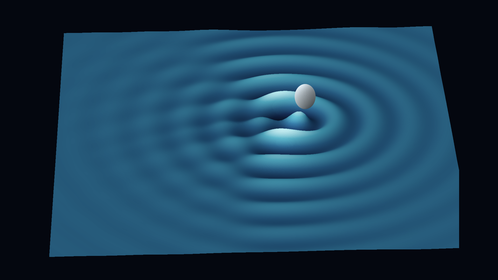
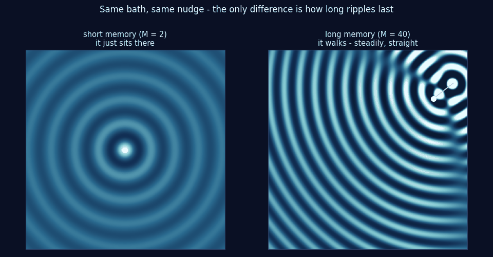

# The Droplet That Walks

*Quest for Entropy #6: I tried to build a probability wave and failed. So this time I went looking for one that already exists — a droplet of oil that bounces on a vibrating bath and builds its own wave, one splash at a time. Then I sat it down for a quantum exam.*

*A particle assembling a wave pattern one visit at a time. This picture is an illustration drawn for this article — not data.*

## The question

Last time I wrote down exactly what I wanted from a probability cloud. Three things:

1. **Spread** — start as a sharp dot, grow into something with width.
2. **Stop spreading, partway** — settle into a shape and hold it.
3. **Oscillate** — and then that shape sloshes, forever.

Notice what the three ask for, underneath. The sharp dot is me knowing exactly where the thing is. Spreading is *losing track* — forgetting, at some rate. Stopping partway means the forgetting has to stop on its own, before it has eaten everything. And oscillating means whatever shape survives still has to move. So the three requirements are really one demand: **forget, but only partway, and keep moving.**

I built six deterministic worlds and none could do it. The ones that kept sloshing never forgot anything — so they never spread. The ones that forgot didn't know where to stop — they ran all the way to flat grey and died there. Nothing I built knew how to forget *partway*.

So I stopped building. The obvious next move: look around. Has anyone, anywhere, got a physical system where a particle and a wave genuinely live together — not on paper, but on a bench?

There is exactly one, and you can watch it with a camera.

## The walker

Silicone oil in a shallow dish. A motor shakes the dish straight up and down. Drop a millimetre-sized droplet of the same oil onto the surface and — if the shaking is tuned just right — the droplet does not sink in. It bounces. And then it starts to travel across the surface, steadily, on its own. It *walks*.

**Yves Couder** and **Emmanuel Fort** discovered these walkers in Paris around 2005. **John Bush's** group at MIT has been building them into a research field ever since — they call it hydrodynamic quantum analogues. The idea they're echoing is much older: **Louis de Broglie's** pilot wave from 1927, where a particle is guided by a wave that travels with it. De Broglie abandoned the picture, **David Bohm** rebuilt it in 1952, and this oil bath is the closest thing anyone has to watching it run.

Before the strange results, the mechanism. It's worth getting exactly right, because the first time I heard it I got it wrong.

## The mechanism, in five steps

Start with what the motor is *not* doing. It shakes the whole dish uniformly, straight up and down. There is no pattern in the shaking. And it's tuned just **below** the strength where the surface would start rippling on its own — so an empty dish stays perfectly flat. The motor does two invisible jobs: it keeps the droplet bouncing instead of merging into the bath, and it keeps ripples alive longer than they'd naturally live. It pays energy. It supplies no shape and no rhythm. Everything patterned on that surface comes from the droplet.

Now the loop:

1. **Bounce.** The droplet hits the surface and stamps one circular ripple. One bounce, one ripple.
2. **Remember.** A ripple on oil normally dies almost instantly. Here the shaking feeds it — and the closer the motor sits to the self-rippling threshold, the longer each ripple survives. Parked just below the threshold, one splash outlives dozens of bounces, so at any moment the surface carries the sum of the last few dozen. The number of bounces a ripple survives is the system's **memory** — a property of the bath, not of the droplet, and the knob everything else in this article turns on.
3. **Read.** The next bounce lands not on flat oil but on the *sum of the old ripples* — and the slope under the landing point kicks the droplet sideways.
4. **Walk.** And the walk is steady and straight — not a drunken stagger. Once the droplet slips off the crest of its own ripple, each bounce lands on the *back slope* of the wave it just stamped, and the slope kicks it forward — the same way, every time. It surfs its own wake. Which way it first tips over is chance; everything after that is steering. The droplet writes a map, then obeys the map.
5. **Walls.** Now put a fence around it — a circular wall standing in the bath. The papers call it a **corral**: the cattle-pen word, nothing to do with reefs — a round enclosure the ripples can't leave. Inside it, every ripple reflects back, and only certain wave patterns fit the boundary. Over thousands of bounces, something remarkable happens: the droplet's position statistics fill in exactly one of those patterns.

That last step deserves a second look. A single droplet, wandering along a complicated path — chaotic in the strict sense: deterministic, never repeating, unpredictable in practice — one definite position at every moment. And the *histogram* of where it has been builds up into the shape of the cavity's own wave mode. A wave-shaped probability pattern, assembled by a particle, one visit at a time.

That is the thing I spent the last article failing to build.

And steps 1 to 4 are simple enough to run. The field has a standard stripped-down model of the walker — each bounce stamps a ripple, ripples fade at the memory rate, the droplet gets kicked by the summed slope — so I implemented it as a small toy and turned one knob:

*A toy run of the standard path-memory model. Same bath, same tiny starting nudge; the only difference between the panels is how long ripples last. Short memory: the droplet bounces in place forever. Long memory: it starts walking by itself — steadily, dead straight — and you can see the mechanism in the picture: the wake is bunched up behind it, smooth ahead. The camera rides along with the droplet.*

Two honest notes on the toy. The walking really is a threshold: below a certain memory it never starts, above it the speed settles to a constant. And every parameter in it is made up — it demonstrates the mechanism, and none of its numbers can be compared to a lab number.

## What the droplet has that my six worlds didn't

Two things, and I think both are necessary.

**One: a two-way loop.** The droplet makes the wave. The wave then steers the droplet. Neither is written down in advance as the cause of the other — each is the other's cause, continuously.

**Two: memory.** This is the one that matters, so let me take it slowly. The droplet is a single point. A wave is a spread-out shape. A point cannot *be* a shape — but its **past** can. Because ripples fade slowly, the surface at any moment carries the sum of the last few dozen bounces: a picture of everywhere the droplet has recently been. The particle stays sharp; the *history* is wide. In this system, the wave is not the droplet. The wave is the droplet's fading record.

And the fading rate is exactly the forgetting knob from the top of this article. Fade instantly, and no shape ever builds — the surface stays flat. Never fade, and the past piles up without limit. The walker sits in between: it forgets at just the rate that lets a shape grow, hold, and keep steering. That middle setting is the thing none of my six worlds had — they could only remember everything or forget everything.

They also had nowhere to write. Motion and chaos, yes — but nothing in them wrote, and nothing got pushed around by what it wrote.

## And even the droplet is bought

There's a motor under that dish, running continuously. Turn it off and the ripples die and the walking stops within a second. So the walker's permanence is paid for by a machine in the room — the same complaint I made last time about the driven pendulum.

But it isn't quite the same complaint, and the difference matters.

The driven pendulum's outside clock set the rhythm directly: the surviving oscillation ran at the metronome's own period. The wave was supplied, then echoed back.

The motor's fingerprints here are real, so let me name them exactly. It sets the **tick**: the droplet's bouncing locks to the shaking, at half the shaking frequency. It sets the **ruler**: the ripple wavelength follows from that frequency and the oil, and that wavelength is the graph paper the whole game is played on — the quantized orbits come spaced by it. And it buys the **memory**: holding the bath just under the rippling threshold is what makes old splashes fade slowly. Energy, a clock, a wavelength — all imported.

Now what the motor does *not* supply: whether the droplet walks, which way it goes, which orbit it settles into, and what pattern builds inside the corral. No knob on the motor chooses any of those. So when I say this little world oscillates, the beat is bought — but the shape, and the choosing, are the droplet's own.

That's a real distinction, and it narrows what an honest machine would need. Not a wave from nothing. A way for a record to persist and steer — paid for out of the system's own pocket instead of by a motor bolted on outside.

## Why the patterns look like atomic orbitals

Every popular article about walkers shows the corral pattern next to an atomic orbital, and the resemblance is real. Here is all it means.

A wave confined by a boundary can only hold certain shapes — the ones that fit. One lump in the middle. Two lobes. A lump inside a ring. Four petals. Which shapes fit is pure geometry: it depends on the boundary and the wavelength, not on what is waving. That's two-hundred-year-old mathematics, no quantum mechanics anywhere in it.

An electron in an atom is a confined wave. The rippled oil inside a corral is a confined wave. So both draw their patterns from the same catalogue — same equation family, completely different physics. The resemblance explains nothing by itself.

What it does explain is the corral result: the walls pick the shape, and the droplet fills it in, dot by dot.

## The run: the quantum exam

So how much quantum behaviour does this classical system actually reproduce? The toy above shows the mechanism, nothing more. Every grade below comes from the laboratory work referenced next to it, so you can check.

- **Confined particle shows wave-mode statistics — PASS.** In a circular corral, the droplet's position histogram locks onto the cavity's own wave pattern. (Harris et al., PRE 2013)
- **Orbits come in discrete sizes, not a continuum — PASS.** On a rotating bath, orbit radii are quantized — but only when the memory is long enough to span the whole orbit. (Fort et al., PNAS 2010)
- **Energy-level splitting — PASS.** Orbiting droplet pairs under rotation split their allowed levels. (Eddi et al., PRL 2012)
- **Tunneling — PASS.** Droplets cross a submerged barrier unpredictably, with crossing probability falling off in barrier width. (Eddi et al., PRL 2009)
- **Double-slit interference — FAIL.** This one did not replicate. Independent groups found no interference in the deflection statistics; the most careful study found the wave does feel both slits, but the statistics are qualitatively different from quantum interference. (Andersen et al., PRE 2015; Pucci et al., JFM 2018)
- **Entanglement and Bell tests — cannot sit the exam.** Out of reach by construction: the wave lives on one oil surface in ordinary space, and Bush's own reviews state this plainly. (Bush, Annu. Rev. Fluid Mech. 2015)

The famous one is the failure. The 2006 double-slit claim — the one in every popular video — was retried by several groups and did not hold up, and the people who established that include the group that works hardest on these systems. If you know walkers only from a video, that's the correction.

## A pattern in the grades

Read down that list again, and something jumps out.

Every **pass** is an experiment where the droplet *stays somewhere* — circling in a corral, held in an orbit, dwelling in a well and testing a barrier over and over. Thousands of bounces in one region. Time for the record on the surface to build up, settle, and start steering.

The one **fail** is the only experiment where the droplet *passes through once and leaves*. Through the slits, gone. No dwelling, no accumulated record, no settled wave — just its own recent splashes, which followed it through one slit.

And I think that points at the real gap. The droplet's wave is a record of **where it has been**. The quantum double slit needs a wave over **where it could go** — covering both slits, before the particle commits to either. A record of the past, however good, is not a map of the possibilities.

There's a second way to say the same thing, and it's sharper. The droplet's wave and the quantum wave don't obey the same wave equation. The bath's ripple field has one wavelength — the ruler set by the motor — it fades, and it's written by the droplet. The quantum wave carries every wavelength at once, never fades, and is handed to the system by the geometry before anything moves. Two different waves.

So why do the passes pass at all? Because inside walls, that difference is invisible. Confined waves have modes, and the modes are picked by the boundary. Ask two different wave equations "what patterns fit inside this circle?" and, at one wavelength, they give the same answer. The walls own the shape, so it doesn't matter whose wave fills it in. Out in the open there are no walls to own anything — the wave equation itself becomes the container the statistics must fill — and the bath's is the wrong one. The double slit is exactly an open-flight experiment. If the two waves were ever going to disagree, it was there.

I want to be careful with all of this: it's a pattern I see in six exam grades plus one way of explaining it, not a law. I haven't proven that staying-versus-passing-through is what decides the grade, and a single new experiment could break the pattern. If you know of one, tell me — that's exactly the kind of correction this series runs on.

## What I take from this

The droplet is the only bench-top system I know of where a particle assembles a wave-shaped probability pattern, and its working part is a **record that steers** — written by the particle, fading at a fixed rate, pushing back on its author.

What it doesn't have — what nothing classical I've met so far has — is the wave that exists *in advance*, spread over paths not yet taken. The passes all live where the record has time to stand in for that; the failure sits exactly where it can't.

So the next machine needs somewhere to write. A single swinging object can't keep a record; there's nowhere to put it. Many of them, coupled together, so a disturbance can travel somewhere else and come back changed — that has room for a record. That's where I went next, and it got further than anything before it.

## The Confession

**I have not been in the oil-bath lab.** Every walker result here comes from the published papers, including the replication failure. What I can do is not repeat the headline claim as though it stood.

**The gif is a toy, not the experiment.** It implements the standard model's mechanism with made-up parameters. It demonstrates that the walk exists and that memory is the knob — and nothing else. No number in it is comparable to a lab number.

**The pattern is a reading, not a result.** "Stays somewhere versus passes through" — and the two-waves explanation of it — is pattern-spotting on top of published grades. It is a hypothesis, not an established mechanism, and it's marked as such above.

**The two ingredients are a hypothesis too.** "A two-way loop plus a fading record" is what I read off one physical system that works. I have not shown they're necessary, or sufficient, or that a machine built from them would do what I want. That's the next several articles, and at least one of them ends badly.

**The walkers are a local pilot wave.** Whatever they do, they cannot reproduce entanglement, and that isn't a small gap. Nothing here is an argument that pilot-wave theory is right.

## What this does NOT claim

- Not a claim that quantum mechanics works this way, and not a derivation of anything quantum. No Born rule appears here and none is attempted.
- The orbital-looking pictures are wave modes of a confined system. The resemblance to atomic orbitals is a shared equation, not shared physics.
- Nothing here says pilot-wave theory is right or wrong. Walking droplets are a classical analogue, not evidence about what quantum particles do.
- The walker results are cited from published work, not reproduced here — including the double-slit replication failure.
- "A record that steers" and "stays versus passes through" are readings of why the walker behaves as it does — directions to explore, not established mechanisms.

## The neighbors

**Yves Couder** and **Emmanuel Fort** discovered the walking droplets; **John Bush's** group at MIT built the field around them — his reviews (2015, 2020) are the honest map of what stands and what doesn't. The pilot-wave idea is **de Broglie's** (1927), rebuilt by **David Bohm** (1952). The people who could not reproduce the double slit deserve naming as much as the people who first reported it: **Andersen and colleagues** (2015) and **Pucci, Harris and Bush** (2018), who did the most careful version. [Quanta wrote it up](https://www.quantamagazine.org/famous-experiment-dooms-pilot-wave-alternative-to-quantum-weirdness-20181011/) if you want the fuller account.

**Bessel** and **Helmholtz** own the confined-wave mathematics — the catalogue of shapes that fit inside a boundary is theirs, a century before quantum mechanics. **Madelung** is the neighbour for reading a wave as a fluid with a density — the picture standing quietly behind this whole quest.

## Run it yourself

The walker toy from the gif ships with this article's code: a short script implementing the field's standard path-memory model (the continuous version is Oza, Rosales & Bush, 2013). One command re-runs it and reprints the memory sweep — which memory values sit still and which walk, and the steady walking speed.

The laboratory results live in the published papers, from the groups named above.

If a number doesn't reproduce, tell me and I'll correct it in public.

## How this was made

I'm a software architect who does this as a hobby, not a physicist, and I say so every time. I set the questions and made the calls about what counts as an answer. The AI wrote the walker toy and the figures, ran the literature search, and argued with me about the definitions — the models are Fable 5, Opus 5 and Sonnet 5.

The honest note for this one: apart from the toy, this article is built on *reading* rather than *running*, and that's a different kind of claim from a measured one. I've tried to mark the seam everywhere it appears. A public honesty ledger records every commissioning error this process has caught.

## Next time

Many oscillators, coupled into a lattice, chaotic enough to keep an arrow of time — and real travelling waves came out of it, with no wave equation written anywhere. Then it hit a wall that took me a long time to understand, and the wall turned out to be the chaos itself. Next time: the most beautiful wrong answer I have ever built.

---

*Quest for Entropy is written by Marijus Masteika. Entropy was always the dark horse for me — connected to information, and maybe hiding answers to everything. That's the quest.*
